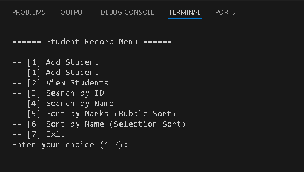
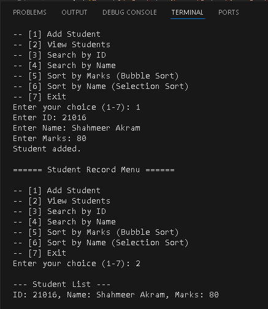

# Student Record Management System

**Python | Console-based Student Management System | CRUD Operations | Bubble Sort (Marks) | Selection Sort (Name) | Interactive Menu**

A **console application** to manage student records. Add, view, search, and sort students using **Bubble Sort** and **Selection Sort**.

---

## Features
- Add and view student records (ID, Name, Marks)  
- Search by **ID** or **Name**  
- Sort by **Marks** (Bubble Sort) or **Name** (Selection Sort)  
- Interactive console menu  

---

## Demo Screenshots
  
*Console interface showing menu and operations.*

  
*Example of adding a new student.*

---

## How to Run
```bash
git clone https://github.com/Shah0x/StudentRecordManagement.git
cd StudentRecordManagement
python Final_project.py
Follow the interactive menu to manage student records.

Author
Shahmeer Akram

GitHub: https://github.com/Shah0x

Email: shahmeerx002@gmail.com

yaml
Copy code
